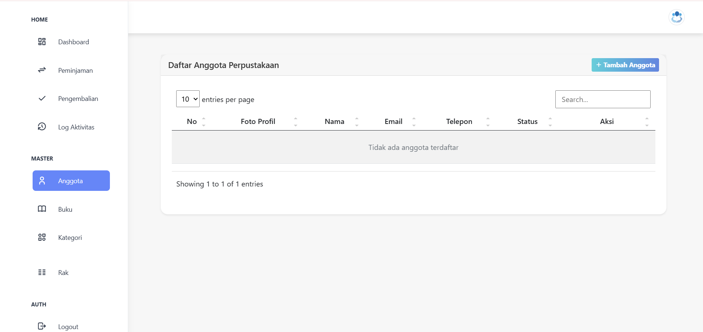
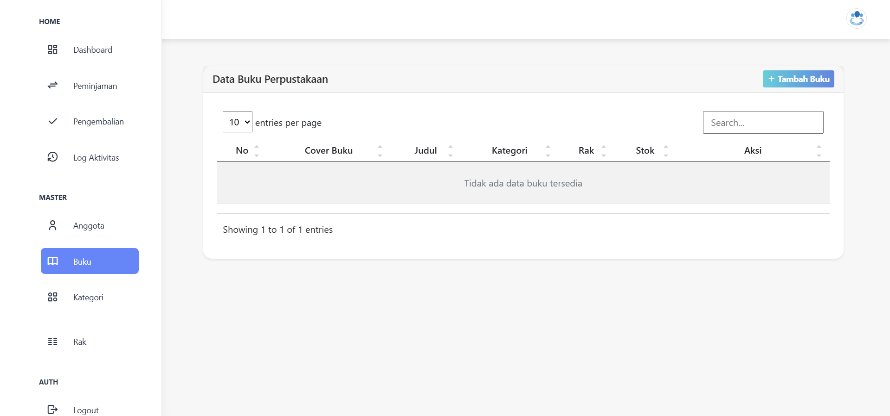
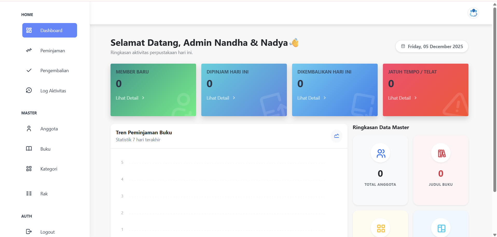
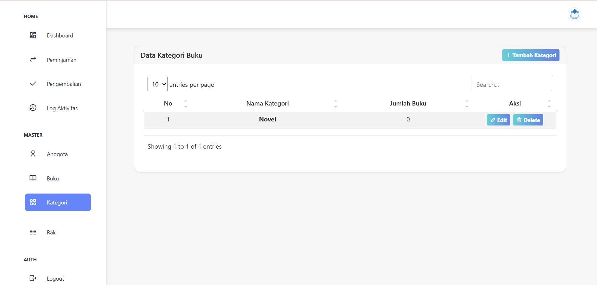
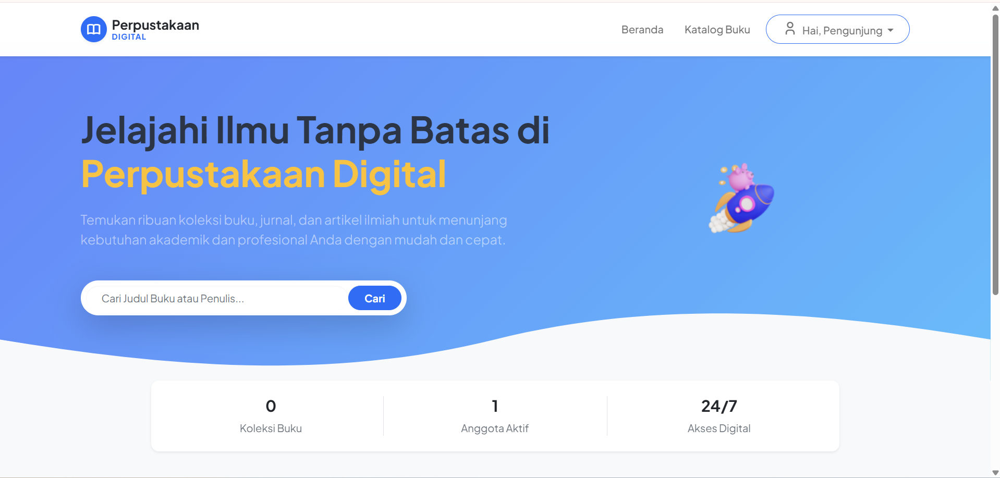
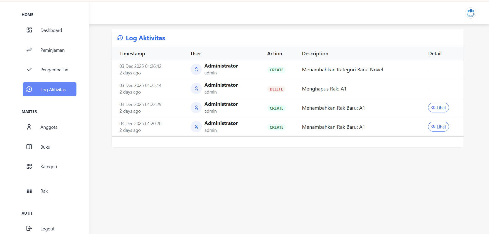
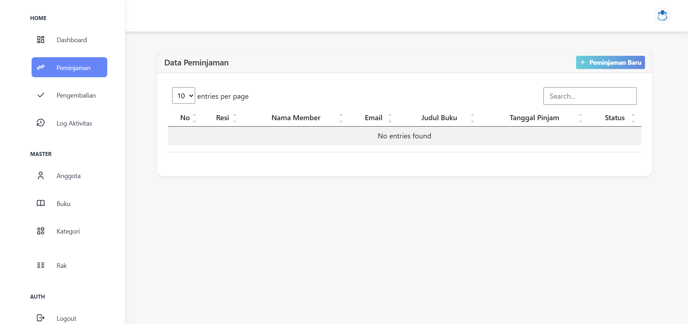
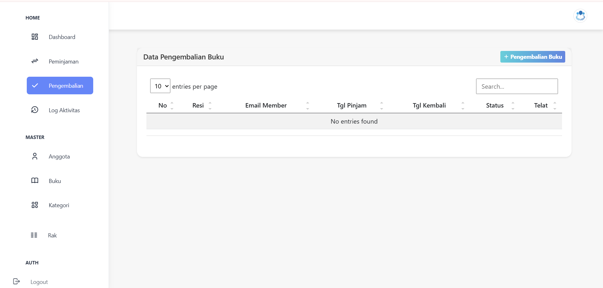
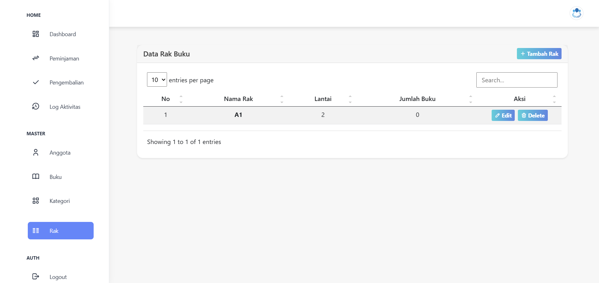

# Final Project Cloud Computing A - Sistem Informasi Perpustakaan

Project ini merupakan *Final Project mata kuliah Cloud Computing A* oleh *Kelompok 7 Algorhythm*. Aplikasi web ini dikembangkan untuk mengelola operasional perpustakaan secara digital, mencakup manajemen buku, anggota, serta seluruh transaksi peminjaman dan pengembalian.

## Daftar Isi

- [Final Project Cloud Computing A - Sistem Informasi Perpustakaan](#final-project-cloud-computing-a---sistem-informasi-perpustakaan)
  - [Daftar Isi](#daftar-isi)
  - [Fitur Utama](#fitur-utama)
    - [Manajemen Perpustakaan](#manajemen-perpustakaan)
    - [Fungsionalitas Pengguna](#fungsionalitas-pengguna)
  - [Tech Stack](#tech-stack)
  - [Persyaratan Sistem](#persyaratan-sistem)
  - [Instalasi](#instalasi)
  - [Konfigurasi Akun Default](#konfigurasi-akun-default)
  - [Role \& Permissions](#role--permissions)
  - [Fitur Berdasarkan Role](#fitur-berdasarkan-role)
    - [Admin](#admin)
    - [Member (Anggota)](#member-anggota)
  - [Struktur Database](#struktur-database)
  - [Screenshot](#screenshot)
    - [1. Halaman Anggota](#1-halaman-anggota)
    - [2. Halaman Buku](#2-halaman-buku)
    - [3. Halaman Dashboard](#3-halaman-dashboard)
    - [4. Halaman Kategori](#4-halaman-kategori)
    - [5. Landing Page](#5-landing-page)
    - [6. Log Activity](#6-log-activity)
    - [7. Peminjaman Buku](#7-peminjaman-buku)
    - [8. Pengembalian Buku](#8-pengembalian-buku)
    - [9. Rak Buku](#9-rak-buku)
  - [Deployment](#deployment)
    - [GitHub Actions](#github-actions)
  - [Kontribusi](#kontribusi)
  - [Lisensi](#lisensi)
  - [Credits](#credits)

## Fitur Utama

### Manajemen Perpustakaan
- ✅ *Manajemen Buku* - CRUD data buku, termasuk cover dan stok.
- ✅ *Manajemen Anggota* - CRUD data anggota perpustakaan (Member).
- ✅ *Manajemen Kategori* - Pengelolaan data master kategori buku.
- ✅ *Manajemen Rak* - Pengelolaan data master lokasi rak buku.
- ✅ *Transaksi Peminjaman* - Pencatatan proses peminjaman.
- ✅ *Transaksi Pengembalian* - Pencatatan pengembalian.

### Fungsionalitas Pengguna
- ✅ *Landing Page* - Halaman depan untuk menampilkan daftar buku yang tersedia dan fitur pencarian.
- ✅ *Bookmark Buku* - Fitur untuk anggota menyimpan daftar buku favorit.
- ✅ *Log Aktivitas* - Mencatat riwayat aktivitas penting pengguna dari Admin.
- ✅ *Autentikasi & Otorisasi* - Fitur Login dan Register dengan pembagian hak akses.

## Tech Stack

Proyek ini dibangun menggunakan teknologi-teknologi berikut:

* *Backend Framework:* Laravel 10.x
* *Language:* PHP 8.1+
* *Database:* MySQL
* *Frontend:* Blade Templating Engine (Template dasar: Soft UI Dashboard / SB Admin 2 berdasarkan file CSS yang terdeteksi)
* *Libraries:* JQuery, SimpleBar, HTML5-QRCode (untuk fitur peminjaman/pengembalian via scan QR code, terdeteksi dari file html5-qrcode.min.js).

## Persyaratan Sistem

Untuk menjalankan proyek ini, pastikan sistem Anda memenuhi persyaratan berikut:

- PHP >= 8.1
- Composer
- MySQL/MariaDB
- Ekstensi PHP: OpenSSL, PDO, Mbstring, Tokenizer, XML, Ctype, JSON, BCMath, Fileinfo.

## Instalasi

Ikuti langkah-langkah di bawah ini untuk menjalankan proyek secara lokal:

1.  *Clone Repository:*
    bash
    git clone [https://github.com/aidilsaputrakirsan-classroom/final-project-cloud-computing-a-cc-kelompok-7-algorhythm.git](https://github.com/aidilsaputrakirsan-classroom/final-project-cloud-computing-a-cc-kelompok-7-algorhythm.git)
    cd final-project-cloud-computing-a-cc-kelompok-7-algorhythm
    

2.  *Install Dependencies Composer:*
    bash
    composer install
    

3.  *Setup Environment:*
    bash
    cp .env.example .env
    php artisan key:generate
    
    Edit file .env dan atur detail koneksi database Anda (contoh menggunakan MySQL):
    env
    DB_CONNECTION=mysql
    DB_HOST=127.0.0.1
    DB_PORT=3306
    DB_DATABASE=nama_database_perpustakaan
    DB_USERNAME=user_database_anda
    DB_PASSWORD=password_database_anda
    

4.  *Jalankan Migrasi Database dan Seeder:*
    bash
    php artisan migrate --seed
    
    (Ini akan membuat semua tabel dan mengisi data awal, termasuk akun default).

5.  *Link Storage Folder (Untuk Cover Buku/Profil):*
    bash
    php artisan storage:link
    

6.  *Jalankan Server Lokal:*
    bash
    php artisan serve
    
    Aplikasi akan dapat diakses di http://127.0.0.1:8000 atau URL server lokal Anda.

## Konfigurasi Akun Default

Setelah menjalankan seeder, Anda dapat login dengan akun default (diasumsikan berdasarkan konvensi seeder Laravel umum):

| Role | Email | Password |
| :--- | :--- | :--- |
| *Admin* | admin@example.com | password |
| *Member* | member@example.com | password |

## Role & Permissions

Sistem ini membagi akses menjadi dua peran utama:

| Role | Deskripsi |
|------|-----------|
| *Admin* | Memiliki hak akses penuh untuk mengelola master data (Buku, Anggota, Kategori, Rak), mengelola transaksi peminjaman/pengembalian, dan melihat log aktivitas sistem. |
| *Member (Anggota)* | Memiliki hak akses untuk melihat daftar buku, mencari buku, menambahkan ke bookmark dan menghapus daftar buku di bookmark. |

## Fitur Berdasarkan Role

### Admin
- Manajemen Lengkap Buku (CRUD)
- Manajemen Anggota (CRUD)
- Manajemen Kategori Buku (CRUD)
- Manajemen Rak Buku (CRUD)
- Konfirmasi dan Penyelesaian Transaksi Peminjaman dan Pengembalian
- Melihat Log Aktivitas Sistem

### Member (Anggota)
- Melihat daftar buku publik
- Mencari dan melihat detail buku
- Menambah/menghapus buku ke daftar Bookmark

## Struktur Database

Tabel-tabel utama yang terdeteksi dalam migrasi:

- users
- members
- categories
- tbl_racks
- books
- book_stock
- table_peminjaman
- bookmarks
- activity_logs

## Screenshot

### 1. Halaman Anggota

### 2. Halaman Buku

### 3. Halaman Dashboard

### 4. Halaman Kategori

### 5. Landing Page

### 6. Log Activity

### 7. Peminjaman Buku

### 8. Pengembalian Buku

### 9. Rak Buku

## Deployment

Proyek Laravel dapat di-deploy ke berbagai platform cloud (seperti AWS, Google Cloud, Azure, atau layanan PaaS seperti Heroku/Vercel).

1.  *Environment Setup*: Pastikan PHP dan dependensi server terinstal.
2.  *Web Server Configuration*: Konfigurasi web server (Nginx/Apache) untuk menunjuk public/ sebagai root direktori.
3.  *Database*: Pastikan database dapat diakses oleh aplikasi.

### GitHub Actions

Project ini sudah dilengkapi dengan GitHub Actions untuk membantu proses auto-deployment. Konfigurasi dapat ditemukan di `.github/workflows/deploy.yml`.

## Kontribusi

Kontribusi dalam bentuk *bug reports*, *feature requests*, atau *pull requests* sangat diterima!

1. Fork repository ini
2. Buat branch fitur baru (`git checkout -b feature/nama-fitur-keren`)
3. Commit perubahan (`git commit -m 'Tambahkan: Deskripsi singkat perubahan'`)
4. Push ke branch (`git push origin feature/nama-fitur-keren`)
5. Buat Pull Request ke branch utama (main/master)

## Lisensi

Project ini dilisensikan di bawah [MIT License](LICENSE).

## Credits

* **Laravel Framework** - [https://laravel.com](https://laravel.com)
* **Landing Page UI** - [https://github.com/ainulbedjo/perpus_digital](https://github.com/ainulbedjo/perpus_digital)
* **Dashboard UI** - [https://github.com/topics/sistem-informasi-perpustakaan](https://github.com/topics/sistem-informasi-perpustakaan)
* **ApexCharts** - [https://www.apexcharts.com/](https://www.apexcharts.com/) (Grafik pada Dashboard)
* **Bootstrap** - [https://getbootstrap.com/] (https://getbootstrap.com/)
* **Kelompok 7 Algorhythm** (Tim Pengembang Proyek)